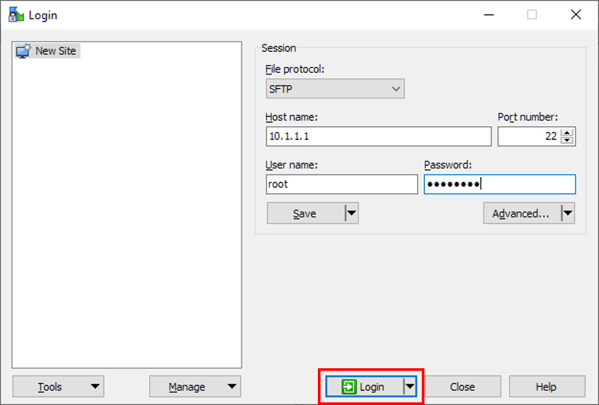
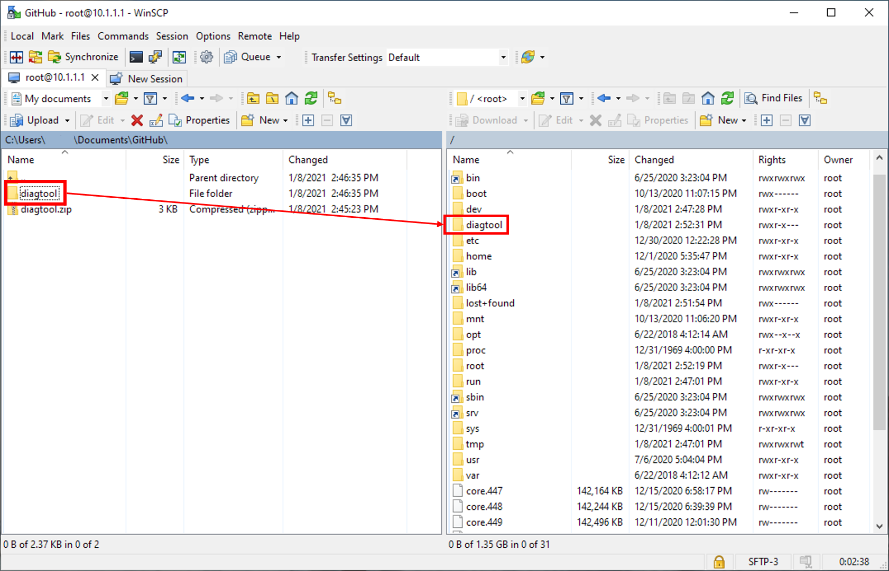
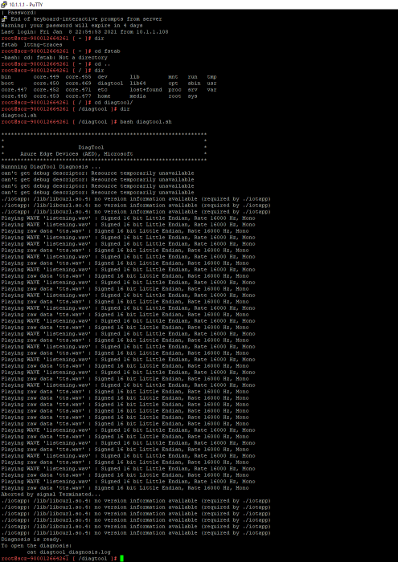
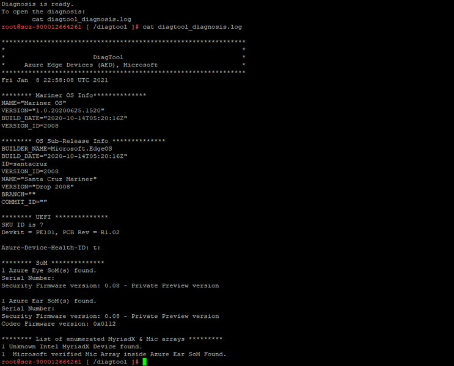
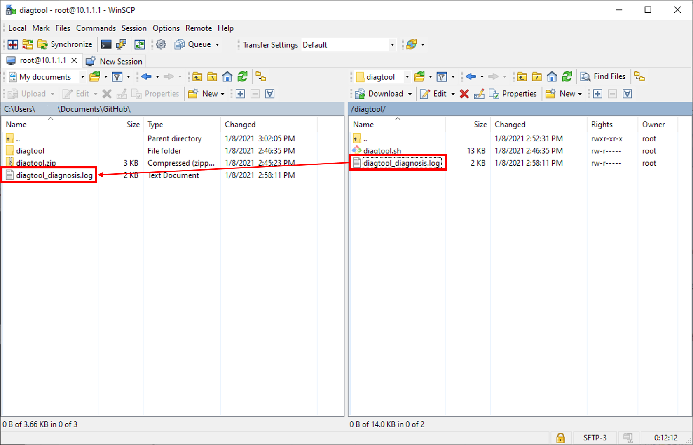

# DiagTool user guide

The Project Santa Cruz Devkit components (carrier board, Ear SOM, and Eye SOM) each have updatable firmware and/or software. The Santa Cruz Diagnostic tool (DiagTool) is a bash script that accomplishes the following when run:

- captures current firmware and software version information for connected devkit components
- outputs the information into a log file

The DiagTool is designed to help ensure the latest versions of software and/or firmware are installed on your devices and to provide additional information to aid troubleshooting.

In this guide, you will learn how to install the tool, run the tool, and view the diagnostic logs.

### DiagTool data

The DiagTool collects the following component information:

|Firmware/Software   |Azure Eye SOM |Azure Ear SOM |PE101 (Carrier Board) |Description                   |
|--------------------|--------------|--------------|----------------------|------------------------------|
|UEFI Firmware       |              |              |X                     |UEFI version running on carrier board and PCB revision. |
|Serial Number       |X             |X             |                      |Unique serial number for Eye and Ear SOMs. |
|Security Firmware   |X             |X             |                      |Security firmware version on all devices. |
|Azure Health ID     |              |              |X                     |Hardware ID (durable across OS re-installs and updates). |
|CODEC Firmware      |              |X             |                      |Audio CODEC info from Ear SOM. |
|MCU Version         |X             |              |                      |Eye SOM MCU version. |
|OS Version <br> Sub-release Version |   |         |X                     |OS version, version ID, and build date. |
|List of Connected MyriadX Chipsets |X   |         |                      |Lists MyriadX chipsets and their Microsoft verification status. |
|List of Mic Arrays  |              |X             |                      |Lists mic arrays and their Microsoft verification status. |

## Prerequisites

- Project Santa Cruz devkit
- Host PC
- [PuTTY](https://www.chiark.greenend.org.uk/~sgtatham/putty/latest.html)
- [WinSCP](https://winscp.net/eng/download.php)
- DiagTool: download [diagtool.zip](https://github.com/microsoft/Project-Santa-Cruz-Preview/blob/main/tools/DiagTool/diagtool.zip) onto your PC and unzip **diagtool.sh**

## Usage

Before starting the procedure below, connect your devkit components and power on the carrier board. If your devkit is not connected to a Wi-Fi network (which is set up through [OOBE](https://github.com/microsoft/Project-Santa-Cruz-Preview/blob/main/user-guides/getting_started/oobe.md)) or a network over Ethernet, connect to your devkit's SoftAP hotspot.

### Establish a WinSCP connection between the host PC and devkit

WinSCP is a tool that allows you to securely transfer files between a local computer and a remote computer. In this case, WinSCP will be used to copy the DiagTool script from your host PC to the carrier board of your devkit.

1. Open WinSCP on your PC and click **New Session**.

1. In the dialog box, do the following:

    1. Select **SFTP** under the **File protocol** dropdown menu.

    1. In the **Host name** box, enter the IP address of your devkit. If your device is connected to the SoftAP network, your IP address will be 10.1.1.1. If your device is connected over Ethernet, use the local IP address of the device, which you can get from the Ethernet router or hub. If your device is connected over Wi-Fi, you must use the IP address that was provided during the [OOBE](https://github.com/microsoft/Project-Santa-Cruz-Preview/blob/main/user-guides/getting_started/oobe.md).

    1. Select **22** under the **Port number** dropdown menu.

    1. Enter your SSH username and password. If you did not create an SSH login during OOBE, enter the root login information (username = root, password = p@ssw0rd).

    1. Click **Login**.

    

Once connected over SFTP, you will be able to see the devkit filesystem on the right side of your WinSCP session and your host PC's filesystem on the left side.

### Transfer the DiagTool to the devkit

1. On the left side of your WinSCP session, navigate to the directory containing your DiagTool folder.

1. Copy the DiagTool folder containing **diagtool.sh** to your devkit by dragging the folder from the left side of your WinSCP session to the right side. The DiagTool folder should now be visible in your devkit filesystem.

    

1. Open PuTTY on your host PC and [SSH into your devkit](https://github.com/microsoft/Project-Santa-Cruz-Preview/blob/main/user-guides/general/troubleshooting/ssh_and_serial_connection_setup.md).

### Run the tool

1. In the PuTTY terminal, navigate into the DiagTool folder.

1. Enter the following command to run the tool:

    ```bash
    bash diagtool.sh
    ```

    

If successful, data collected by the tool will be saved in a file called **diagtool_diagnosis.log**.

### View diagtool_diagnosis.log  

To view the contents of **diagtool_diagnosis.log**, enter the following command:

```bash
cat diagtool_diagnosis.log 
```



The log will contain the information listed in the table above. Additionally, the log may include any of the following statements:

- “No SoM controllers found:" this indicates that SoM security firmware is missing.
- “1 Azure Eye/Ear SoM(s) found but incorrect SoM controller VID/PID:" this indicates that the Eye/Ear SoM security firmware is present, but the VID/PID is incorrect.

For further analysis and/or troubleshooting, you may copy this file to your host PC by dragging the file from your devkit's filesystem to your host PC's filesystem in WinSCP.


